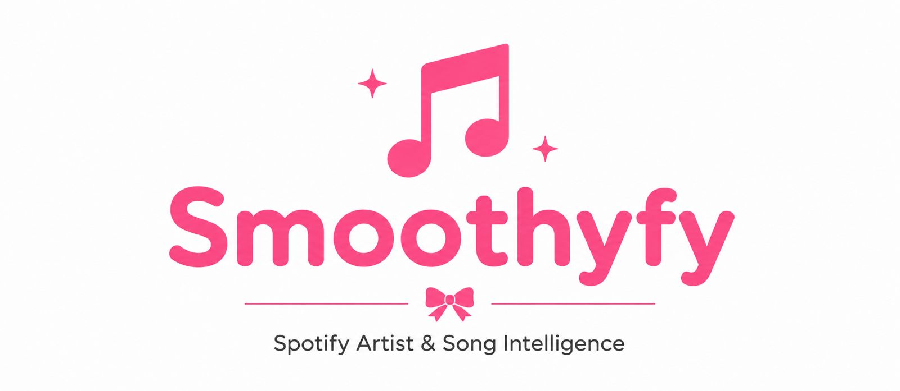
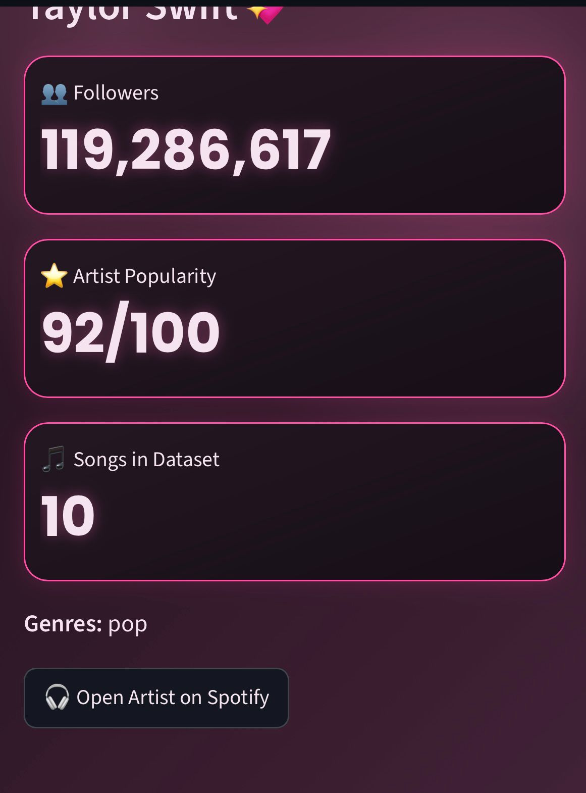
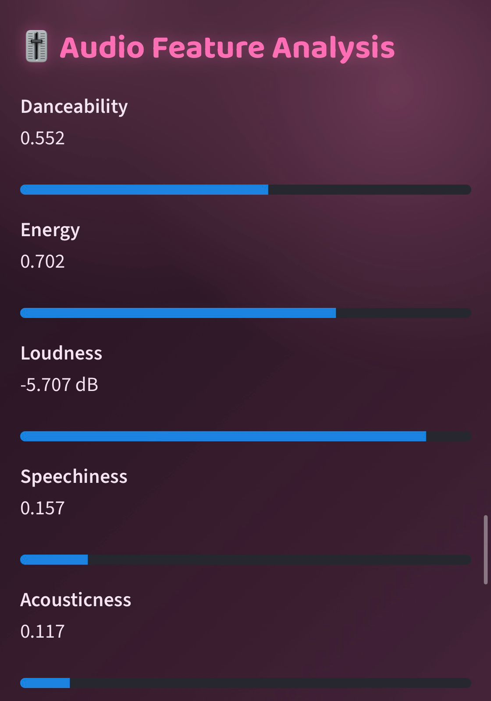
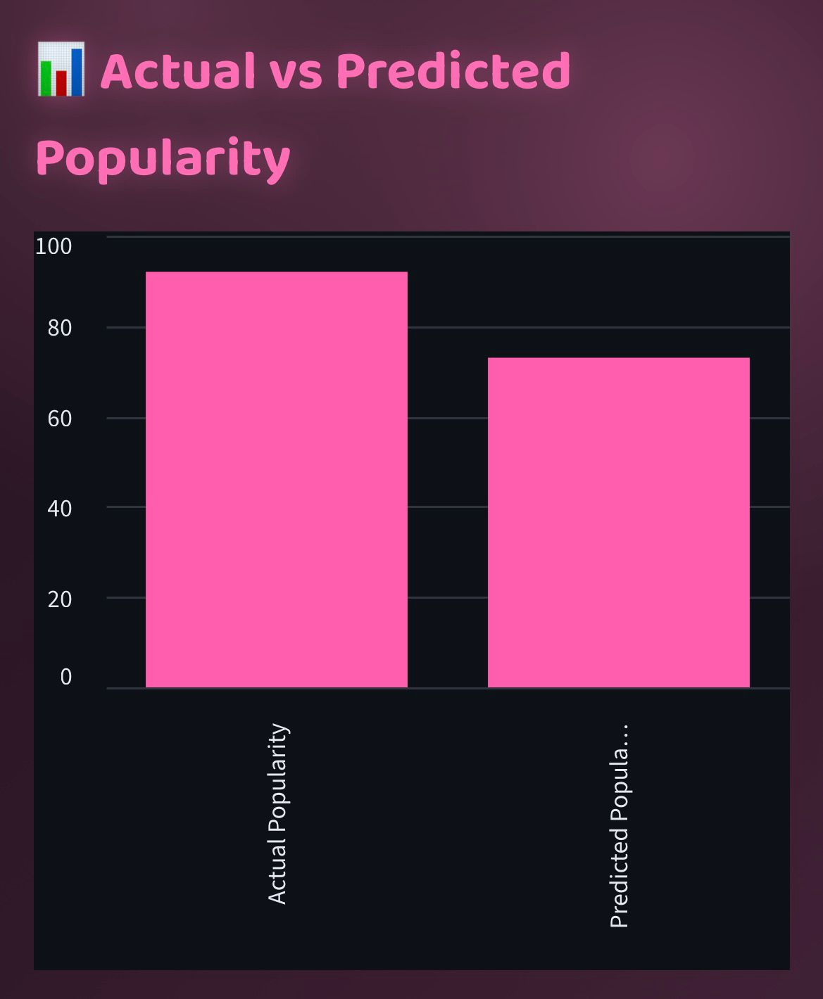
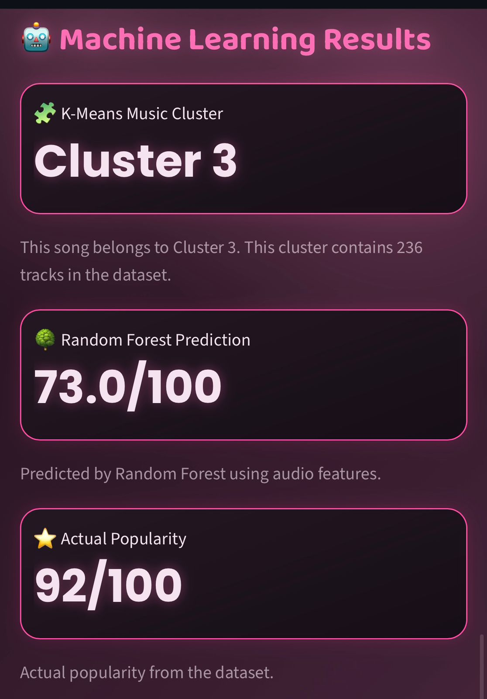

<div align="center">



<br><br>

### 🎵 Spotify Artist & Song Intelligence

**An interactive music analytics and machine learning dashboard built with Python and Streamlit.**

<br>

<a href="https://smoothyfy.streamlit.app/">
  <strong>🌸 LIVE DEMO — OPEN SMOOTHYFY</strong>
</a>

</div>

---

# 💗 About Smoothyfy

**Smoothyfy** is an interactive Spotify Artist & Song Intelligence dashboard
developed using **Python and Streamlit**.

The project combines data analysis, visualization, and machine learning to
explore Spotify music data and provide insights into artists, songs, audio
features, popularity, and music patterns.

### ✨ What Smoothyfy provides

- 🎤 Artist search and exploration
- 📊 Artist and song insights
- 🎵 Song-level analysis
- 🎧 Audio-feature analysis
- 🔥 Top 10 song analysis
- 🤖 Track popularity prediction
- 🧠 Music clustering using K-Means
- 📈 Interactive visualizations
- 🌸 Interactive Streamlit dashboard

---

# 🎤 Artist Intelligence

Smoothyfy allows users to search for artists and explore information available
in the Spotify dataset.

## 🔎 Artist Search

Search for an artist directly from the dashboard and explore the available
artist information.

<p align="center">
  
</p>

---

## 👤 Artist Details

The artist details section provides a deeper look at the selected artist and
their available Spotify information.

<p align="center">
  
</p>

---

# 🎵 Song Intelligence

Smoothyfy provides detailed analysis of songs in the Spotify dataset.

Users can explore song information and understand how different attributes
relate to the music.

<p align="center">
  
</p>

---

# 🎧 Audio Feature Analysis

Spotify songs contain several audio characteristics that can be analyzed to
identify patterns in music.

Smoothyfy explores audio-related features to provide a better understanding of
song characteristics.

<p align="center">
  
</p>

---

# 🔥 Top 10 Songs

Smoothyfy also provides a view of the **Top 10 songs** based on the popularity
information available in the dataset.

<p align="center">
  
</p>

---

# 🤖 Machine Learning

Smoothyfy contains **two main machine learning components**.

---

## 1. 🔥 Popularity Prediction

### Random Forest Regression

A **Random Forest Regression** model is used to predict track popularity using
relevant song and audio features.

The trained model is saved as:

```text
popularity_model.pkl
```

The model's prediction performance is visualized using an
**Actual vs Predicted Popularity** plot.

<p align="center">
  
</p>

---

## 2. 🧠 Music Clustering

### K-Means Clustering

**K-Means clustering** is used to group songs according to similarities in
their audio-feature patterns.

This allows songs with similar characteristics to be organized into different
clusters.

The trained clustering model is saved as:

```text
kmeans_model.pkl
```

The scaled features used by the model are stored using:

```text
scaler.pkl
```

The resulting clustered song data is stored in:

```text
clustered_songs.csv
```

<p align="center">
  
</p>

---

# 📊 Project Workflow

```text
Spotify Dataset
      │
      ▼
Data Cleaning & Preparation
      │
      ▼
Exploratory Data Analysis
      │
      ├───────────────┐
      ▼               ▼
Song & Artist     Audio Feature
Analysis          Analysis
      │               │
      └───────┬───────┘
              ▼
       Machine Learning
              │
       ┌──────┴──────┐
       ▼             ▼
Random Forest     K-Means
Popularity        Clustering
Prediction
       │             │
       └──────┬──────┘
              ▼
       Streamlit Dashboard
```

---

# 🛠️ Technologies Used

| Technology | Purpose |
|---|---|
| 🐍 Python | Core programming language |
| 🐼 Pandas | Data manipulation and analysis |
| 🔢 NumPy | Numerical computation |
| 📊 Matplotlib | Data visualization |
| 🤖 Scikit-learn | Machine learning |
| 🌐 Streamlit | Interactive web application |
| 📓 Jupyter Notebook | Data analysis and model development |
| 🐙 GitHub | Version control and project hosting |

---

# 📁 Project Structure

```text
Smoothyfy/
│
├── .devcontainer/
│
├── Smoothyfy-Final.py
├── spotifydataset.csv
├── requirements.txt
│
├── popularity_model.pkl
├── kmeans_model.pkl
├── scaler.pkl
├── clustered_songs.csv
│
├── Smoothyfy-logo-p.png
│
├── Artists-searched.png
├── Artists-details.png
├── Analysis-song.png
├── Audio-feature-analysis.png
├── top 10.png
├── Actual-vs-predicted-popularity.png
├── Machine-learning-result.png
│
└── README.md
```

---

# 📋 File Description

| File | Description |
|---|---|
| `Smoothyfy-Final.py` | Main Streamlit application containing the Smoothyfy dashboard |
| `spotifydataset.csv` | Spotify dataset used for analysis and machine learning |
| `popularity_model.pkl` | Trained Random Forest Regression model for track popularity prediction |
| `kmeans_model.pkl` | Trained K-Means clustering model for grouping songs |
| `scaler.pkl` | Saved feature scaler used during machine learning preprocessing |
| `clustered_songs.csv` | Dataset containing songs and their assigned clusters |
| `requirements.txt` | Python packages required to run the application |
| `Smoothyfy-logo-p.png` | Main Smoothyfy branding/logo used in the README |
| `Artists-searched.png` | Screenshot of the artist search section |
| `Artists-details.png` | Screenshot of the artist details section |
| `Analysis-song.png` | Screenshot of song analysis |
| `Audio-feature-analysis.png` | Screenshot of audio-feature analysis |
| `top 10.png` | Screenshot of the Top 10 songs section |
| `Actual-vs-predicted-popularity.png` | Visualization comparing actual and predicted popularity |
| `Machine-learning-result.png` | Screenshot showing machine learning results |
| `README.md` | Project documentation |

---

# ⚙️ How to Run Smoothyfy

### 1. Clone the repository

```bash
git clone YOUR_GITHUB_REPOSITORY_URL
```

### 2. Open the project directory

```bash
cd Smoothyfy
```

### 3. Install dependencies

```bash
pip install -r requirements.txt
```

### 4. Run the Streamlit application

```bash
streamlit run Smoothyfy-Final.py
```

The application will open in your browser.

---

# 🌸 Key Highlights

| Area | Implementation |
|---|---|
| 🎤 Artist Intelligence | Artist search and details |
| 🎵 Song Intelligence | Song-level analysis |
| 🎧 Audio Intelligence | Audio-feature exploration |
| 🔥 Popularity Prediction | Random Forest Regression |
| 🧠 Music Clustering | K-Means Clustering |
| 📊 Visualization | Interactive data analysis |
| 🌐 Web Application | Streamlit |

---

# 🎯 Project Objective

The goal of Smoothyfy is to demonstrate how **Data Science and Machine
Learning can be applied to music data** to discover patterns, analyze songs
and artists, and build an interactive analytical application.

---

<div align="center">

## 🎵 Smoothyfy

**Spotify Artist & Song Intelligence**

🌸 *Where music meets data and intelligence.*

</div>
